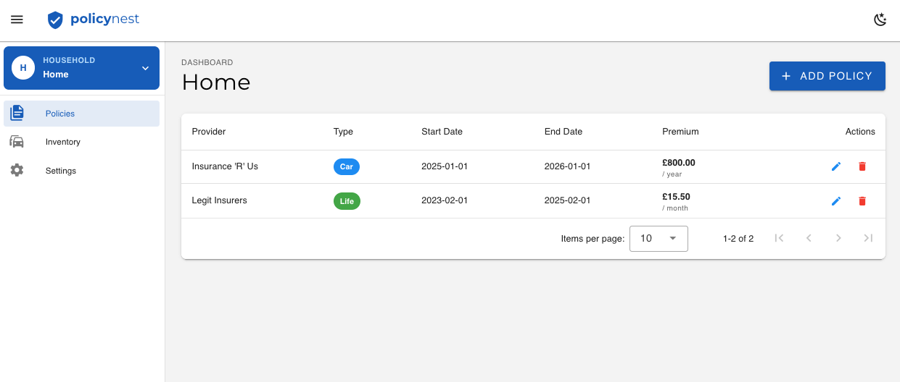
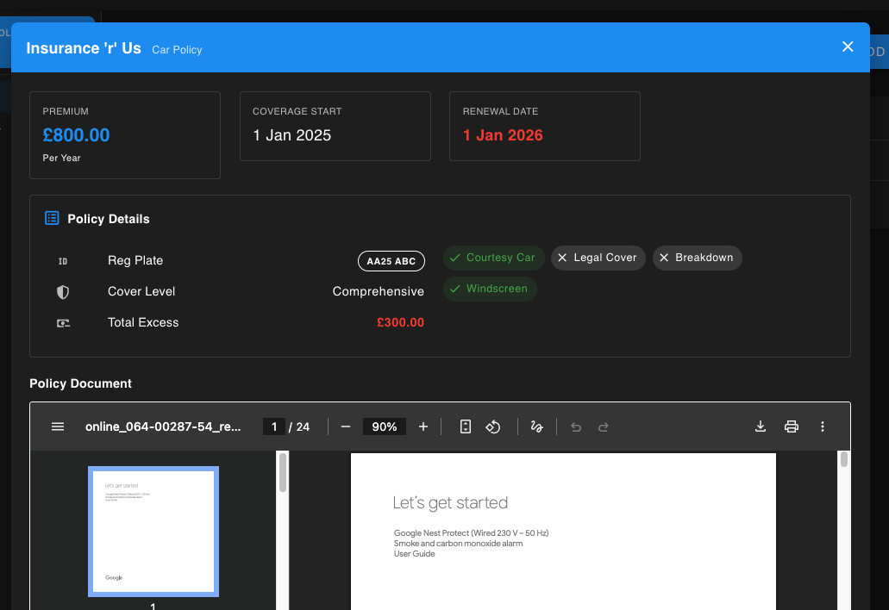
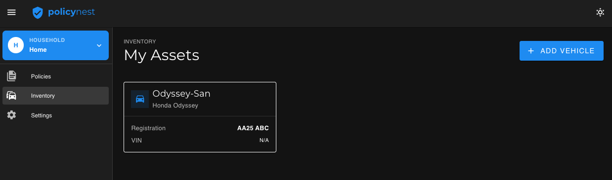
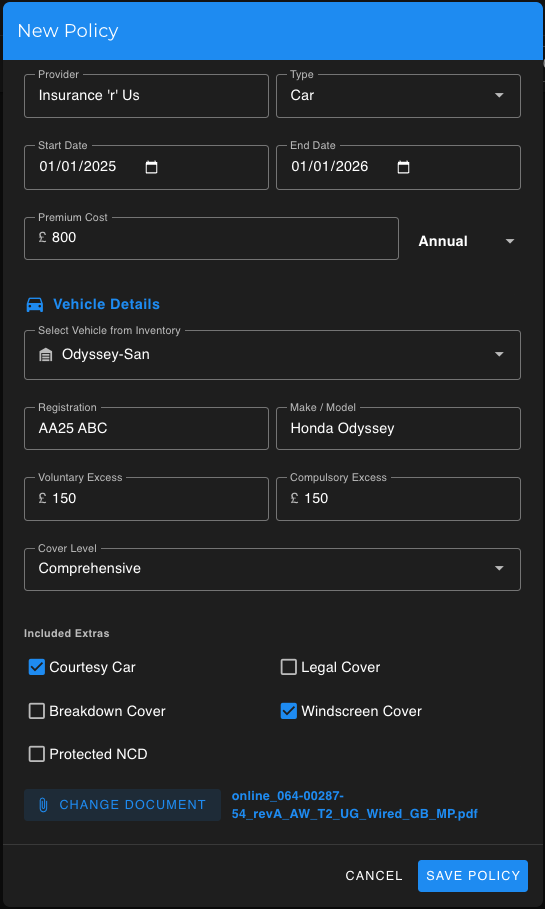

# PolicyNest

> **Stop digging through email attachments.** Keep your family's policy documents safe, organized, and fully under your control.


A modern, containerized application to track insurance policies (Car, Home, Life, Medical, etc.) across multiple households. Built for self-hosters who value privacy and data ownership.



## ✨ Features

* **🏠 Multi-Household Support:** Manage policies for different homes or family groups from a single instance.
* **📄 Document Storage:** Upload and view policy PDFs directly in the browser.
* **📊 Dashboard Overview:** Quick glance at active policies, premiums, and coverage dates.
* **🌗 Dark/Light Mode:** Fully responsive UI with persistent theme preferences.
* **⚡ Modern Stack:** Built with Vue 3 (Vuetify) and FastAPI.
* **🐳 Dockerized:** One command setup with Nginx handling SPA routing and static assets.

## Screenshots

_Policy deatils_



_Creating household assets_



_Create new Car insurance policy_



More screenshots are available in the [docs](./docs/img/)

## 🚀 Quick Start (Docker)

This is the recommended way to run the application.

1.  **Clone the repository**
    ```bash
    git clone https://github.com/SplinterHead/policynest.git
    cd policynest
    ```

2.  **Start the stack**
    ```bash
    docker-compose up --build -d
    ```

3.  **Access the App**
    * **Frontend:** `http://localhost:8080`
    * **Backend API Docs:** `http://localhost:8000/docs`

4.  **First Run:** You will be prompted to create your first "Household" (e.g., *The Smith Residence*) to initialize the database.

---

## 🗺️ Roadmap
- [ ] Authentication: Add user login support.
- [ ] Database Integration: Switch from SQLite to PostgreSQL for larger deployments.
- [ ] Assets Layer: Attach policies to specific assets (e.g., "2015 Honda Civic").
- [ ] Renewal Alerts: Email notifications when a policy is ending.

---

## 🛠️ Development Setup

If you want to contribute or run the app locally without Docker:

### Backend (FastAPI + Poetry)

1.  Navigate to the backend:
    ```bash
    cd backend
    ```
2.  Install dependencies (ensure you have [Poetry](https://python-poetry.org/) installed):
    ```bash
    poetry install
    ```
3.  Run the server:
    ```bash
    poetry run uvicorn app.main:app --reload
    ```

### Frontend (Vue 3 + Vite)

1.  Navigate to the frontend:
    ```bash
    cd frontend
    ```
2.  Install dependencies:
    ```bash
    npm install
    ```
3.  Start the dev server:
    ```bash
    npm run dev
    ```

---

## 🏗️ Architecture

The project follows a standard 3-tier architecture containerized via Docker Compose.

* **Frontend:** Vue 3, Vuetify, Vue Router (Served via Nginx in production).
* **Backend:** FastAPI (Python 3.9).
* **Database:** SQLite (Default, strictly local) with SQLAlchemy ORM.
* **Storage:** Local filesystem (`/uploads` volume) for PDF documents.

### Directory Structure

```text
policynest/
├── backend/
│   ├── app/           # FastAPI application code
│   ├── tests/         # Pytest unit tests
│   ├── pyproject.toml # Poetry dependency management
│   └── Dockerfile
├── frontend/
│   ├── src/
│   │   ├── components/# Reusable UI components
│   │   ├── views/     # Page views (Policies, Settings)
│   │   └── router/    # Vue Router configuration
│   ├── nginx.conf     # SPA routing configuration
│   └── Dockerfile
└── docker-compose.yml
```

---

## 🤝 Contributing
Pull requests are welcome. For major changes, please open an issue first to discuss what you would like to change.

---

## 📄 License
[MIT](https://choosealicense.com/licenses/mit/)